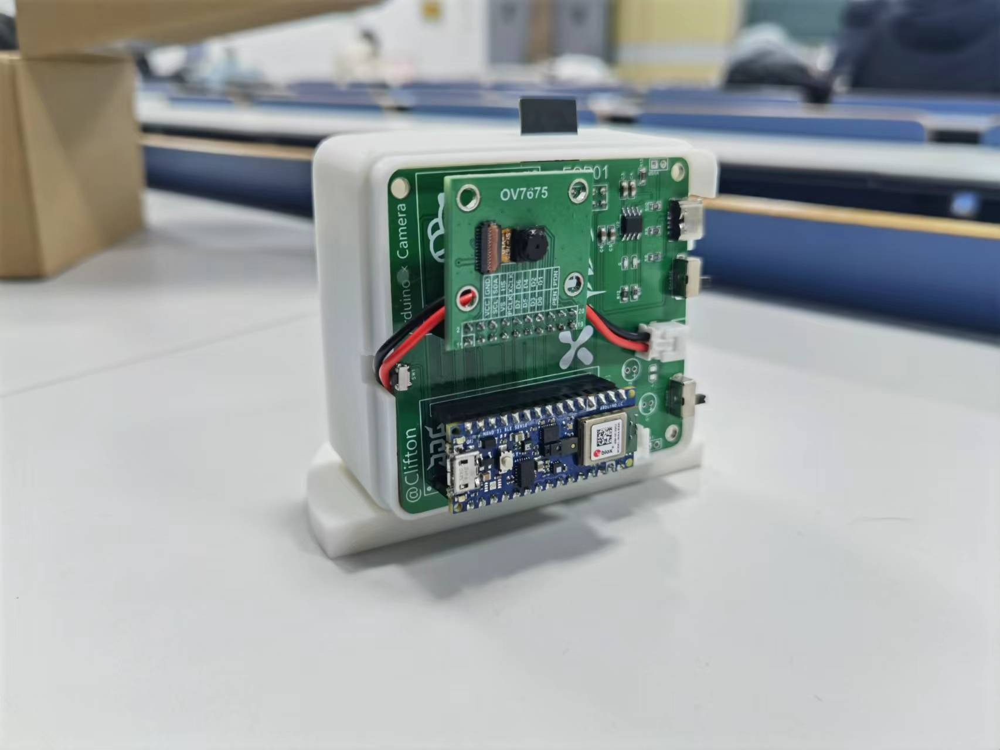
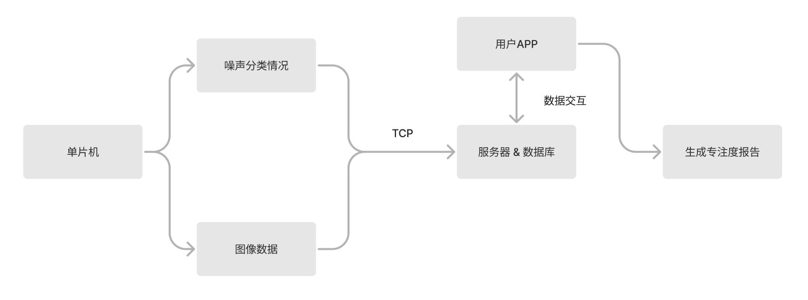
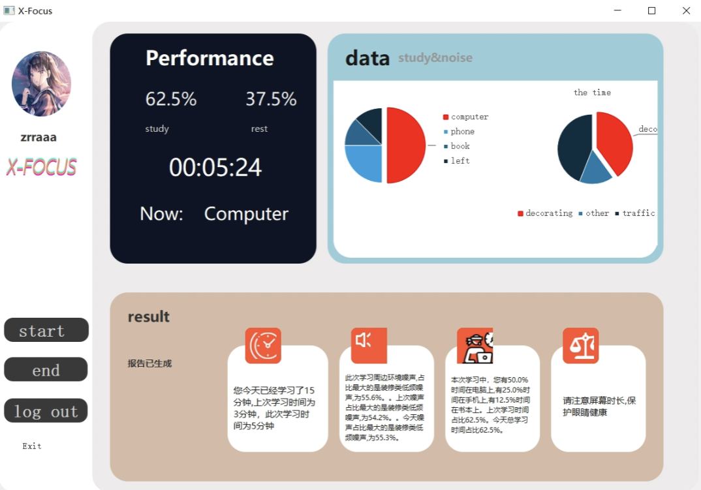

# X-Focus 智能桌面伴侣

一个可检测使用者学习和工作情况以及环境噪声的桌面伴侣。在APP内可查看监督报告。

随着媒体技术的发展和互联网时代的革命，洪流般的信息在推动时代进步的同时也无形中降低了人们的耐心阈值。当“专注”成为普遍关注的话题，如何检测专注度便成为了亟待解决的问题。

X-Focus诞生于这样的情境之下，旨在打造一款陪伴用户学习与工作的智能桌面伴侣，助力检验专注度。

## 技术路径

硬件部分，X-Focus采用Arduino Nano 33 BLE作为主控，利用ov7675摄像头实时读取用户的工作状态，同时利用MP34DT05实时采集环境噪声。噪声经由存在单片机内部的预训练神经网络模型权重参数直接计算得分类结果，而图像数据则通过esp8266基于TCP发送给服务器，在服务器中通过SVM预测用户当前的工作状态。软件部分，我们基于PYQT5搭建了轻量级的上位机APP，协同后端SQLite数据库进行数据交互，每个用户都可注册自己的账号，查阅独属于自己的专注度报告，实现了一台设备的多人共享，助力X-Focus走进图书馆，办公室等公共场合。

## 功能演示

开机启动X-Focus

https://github.com/zrrraa/X-Focus/assets/105407119/f7af75d5-0d5c-4295-9356-713c125a4616

使用电脑状态检测

https://github.com/zrrraa/X-Focus/assets/105407119/e276f914-b43a-4757-9397-768390018e64

离开状态检测

https://github.com/zrrraa/X-Focus/assets/105407119/6a12a4db-4bc4-4c27-8759-1919a981f59a

读书状态以及使用手机状态检测

https://github.com/zrrraa/X-Focus/assets/105407119/01b09853-e76d-4802-b92e-d4feedbde9a1

用户在每一次学习或工作结束后都可在APP上查看状态报告，并与过去的报告进行对比，分析专注度。

## 参考资料

[SVMImageClassification](https://github.com/chestnut24/SVMImageClassification "基于SVM的简单机器学习分类，可以使用svm, knn, 朴素贝叶斯，决策树四种机器学习方法进行分类")
